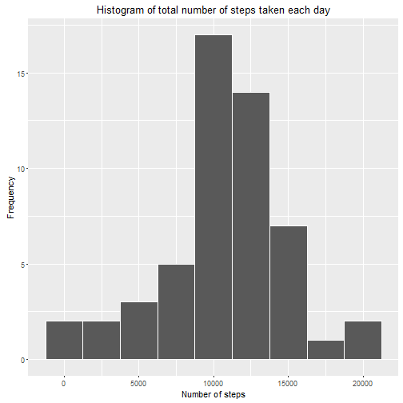
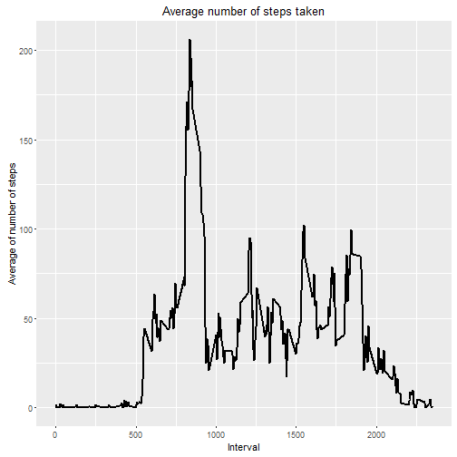
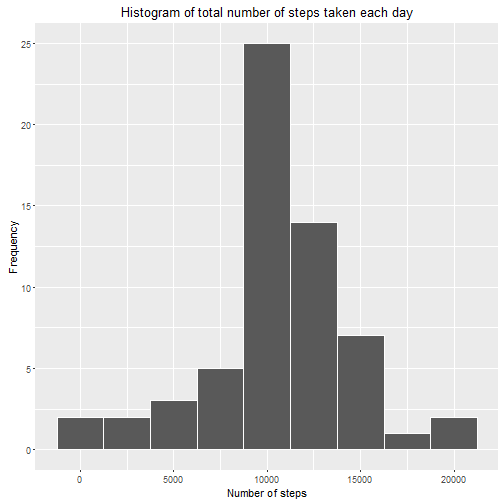
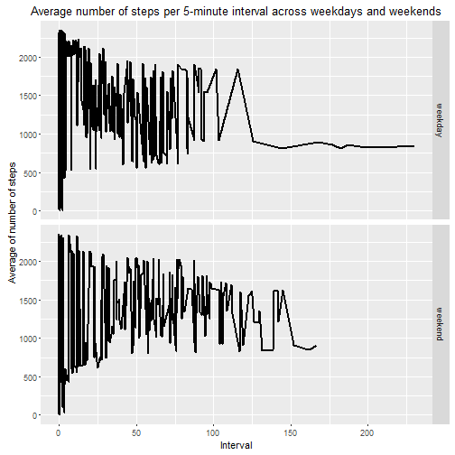

```r
---
title: "Activity Monitoring Device"
output: html_document
---
```

```
## Error: <text>:6:0: unexpected end of input
## 4: ---
## 5: 
##   ^
```


## Introduction

It is now possible to collect a large amount of data about personal movement using activity monitoring devices such as a Fitbit, Nike Fuelband, or Jawbone Up. These type of devices are part of the "quantified self" movement - a group of enthusiasts who take measurements about themselves regularly to improve their health, to find patterns in their behavior, or because they are tech geeks. But these data remain under-utilized both because the raw data are hard to obtain and there is a lack of statistical methods and software for processing and interpreting the data.

This assignment makes use of data from a personal activity monitoring device. This device collects data at 5 minute intervals through out the day. The data consists of two months of data from an anonymous individual collected during the months of October and November, 2012 and include the number of steps taken in 5 minute intervals each day.

##Peer assessment

###1. Code for reading in the dataset and/or processing the data


```r
library(ggplot2)
library(lubridate)

setwd("C:\\Users\\Gemma\\Dropbox\\Coursera\\ReproducibleResearch\\Week2\\Project")

if(!file.exists('activity.csv')){
    unzip('activity.zip')
}
activityData <- read.table("activity.csv",header = TRUE,sep = ",",quote = '"',na.strings = "NA")

str(activityData)
```

```
## 'data.frame':	17568 obs. of  3 variables:
##  $ steps   : int  NA NA NA NA NA NA NA NA NA NA ...
##  $ date    : Factor w/ 61 levels "2012-10-01","2012-10-02",..: 1 1 1 1 1 1 1 1 1 1 ...
##  $ interval: int  0 5 10 15 20 25 30 35 40 45 ...
```

```r
head(activityData)
```

```
##   steps       date interval
## 1    NA 2012-10-01        0
## 2    NA 2012-10-01        5
## 3    NA 2012-10-01       10
## 4    NA 2012-10-01       15
## 5    NA 2012-10-01       20
## 6    NA 2012-10-01       25
```

###2. Histogram of the total number of steps taken each day

```r
#total steps by date
stepsByDate <- aggregate(steps~date, data = activityData, FUN = sum)
summary(stepsByDate)
```

```
##          date        steps      
##  2012-10-02: 1   Min.   :   41  
##  2012-10-03: 1   1st Qu.: 8841  
##  2012-10-04: 1   Median :10765  
##  2012-10-05: 1   Mean   :10766  
##  2012-10-06: 1   3rd Qu.:13294  
##  2012-10-07: 1   Max.   :21194  
##  (Other)   :47
```

```r
g<- ggplot(stepsByDate, aes(steps))

g + geom_histogram(binwidth=2500, col= "white") +
    labs(x="Number of steps", y = "Frequency") +
    labs(title = "Histogram of total number of steps taken each day")
```



###3. Mean and median number of steps taken each day

```r
meanStepsByDay <- mean(stepsByDate$steps, na.rm=TRUE)
meanStepsByDay
```

```
## [1] 10766.19
```

```r
medianStepsByDay <-median(stepsByDate$steps)
medianStepsByDay
```

```
## [1] 10765
```


Mean and median number of steps taken each day are 10766 and 10765 respectively 


###4. Time series plot of the average number of steps taken

```r
stepsByInterval <- aggregate(steps~interval, data = activityData, FUN = mean)

g<- ggplot(stepsByInterval, aes(interval, steps))

g + geom_line(size=1) +
    labs(x="Interval", y = "Average of number of steps") +
    labs(title = "Average number of steps taken")
```



###5. The 5-minute interval that, on average, contains the maximum number of steps

```r
intervalMaximum<-stepsByInterval[which.max(stepsByInterval$steps),]
```

The 5-minute interval that, on average, contains the maximum number of steps is 835 and contains 206.1698113on average.

###6. Code to describe and show a strategy for imputing missing data
1. Calculate and report the total number of missing values in the dataset (i.e. the total number of rows with NAs)

```r
sum(is.na(activityData))
```

```
## [1] 2304
```

2. Devise a strategy for filling in all of the missing values in the dataset. The strategy does not need to be sophisticated. For example, you could use the mean/median for that day, or the mean for that 5-minute interval, etc.

```r
fillValue <- function(steps, interval){
    if (!is.na(steps))
        steps
    else
        #mean for that 5-minute interval
        stepsByInterval$steps[stepsByInterval$interval==interval]
}
```

3. Create a new dataset that is equal to the original dataset but with the missing data filled in.

```r
imputedData <- activityData
imputedData$steps<-mapply(fillValue, imputedData$steps, imputedData$interval)
```
###7. Histogram of the total number of steps taken each day after missing values are imputed
1. Make a histogram of the total number of steps taken each day and Calculate and report the mean and median total number of steps taken per day. Do these values differ from the estimates from the first part of the assignment? What is the impact of imputing missing data on the estimates of the total daily number of steps?


```r
stepsByDateImputed <- aggregate(steps~date, data = imputedData, FUN = sum)
summary(stepsByDateImputed)
```

```
##          date        steps      
##  2012-10-01: 1   Min.   :   41  
##  2012-10-02: 1   1st Qu.: 9819  
##  2012-10-03: 1   Median :10766  
##  2012-10-04: 1   Mean   :10766  
##  2012-10-05: 1   3rd Qu.:12811  
##  2012-10-06: 1   Max.   :21194  
##  (Other)   :55
```

```r
g<- ggplot(stepsByDateImputed, aes(steps))

g + geom_histogram(binwidth=2500, col= "white") +
    labs(x="Number of steps", y = "Frequency") +
    labs(title = "Histogram of total number of steps taken each day")
```



```r
meanStepsByDayImputed <- mean(stepsByDateImputed$steps)
meanStepsByDayImputed
```

```
## [1] 10766.19
```

```r
medianStepsByDayImputed <-median(stepsByDateImputed$steps)
medianStepsByDayImputed
```

```
## [1] 10766.19
```


Now the Mean and median number of steps taken each day are the same 10766. The impact is higher median.

###8. Panel plot comparing the average number of steps taken per 5-minute interval across weekdays and weekends

```r
classifyDay <- function(date){
    if (wday(date) %in% c(2,3, 4, 5, 6))
        "weekday"
    else
        "weekend"

}

imputedData$dayType <- mapply(classifyDay, ymd(imputedData$date))

imputedDataByIntDayType <- aggregate(steps ~ interval + dayType, data= imputedData, FUN=mean)

g<- ggplot(imputedDataByIntDayType, aes(steps, interval))

g + geom_line(size=1) +
    facet_grid(dayType ~ .) +
    labs(x="Interval", y = "Average of number of steps") +
    labs(title = "Average number of steps per 5-minute interval across weekdays and weekends")
```


```
```

